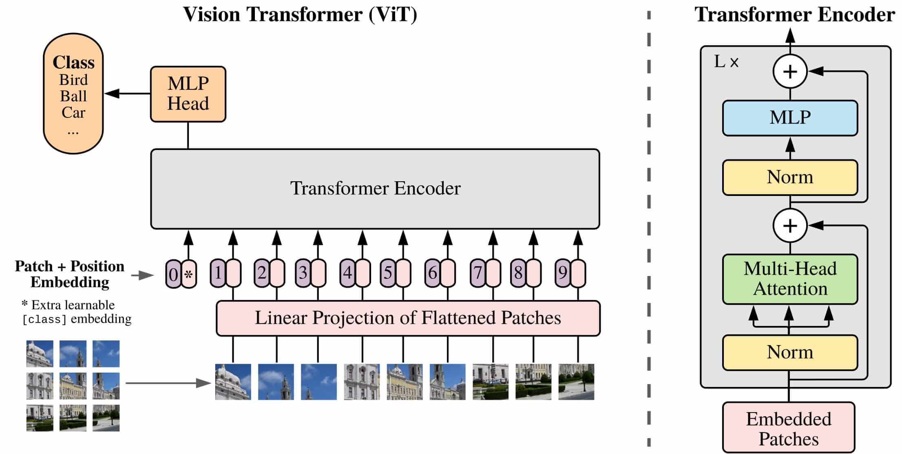

<div align="center">

# 🔬 Vision Transformer (ViT) — From Scratch

**A PyTorch implementation of the Vision Transformer**
**applied to Animal Faces classification (Cat · Dog · Wild)**

[](https://python.org)
[](https://pytorch.org)

---

*Implementing the original [An Image is Worth 16x16 Words](https://arxiv.org/abs/2010.11929) paper from scratch — no pretrained backbones, no shortcuts.*

</div>

## 📖 Overview

This repository contains a **from-scratch** implementation of the **Vision Transformer (ViT)** architecture in PyTorch.
The model is trained on the [Animal Faces HQ (AFHQ)](https://www.kaggle.com/datasets/andrewmvd/animal-faces) dataset to classify images into three categories: **Cat**, **Dog**, and **Wild**.

Every building block — patch embedding, multi-head self-attention, encoder layers, and the classification head — is implemented manually to provide a deep understanding of how ViT works under the hood.

## 🏗️ Architecture



### Key Components

| Module | Description |
|---|---|
| `PatchCreation` | Splits image into 16×16 non-overlapping patches via `Conv2d` and projects to embedding space |
| `ViTInputLayer` | Combines patch embeddings + learnable CLS token + positional embeddings |
| `MultiHeadAttention` | Scaled dot-product attention with 8 parallel heads |
| `FeedForwardLayer` | 2-layer MLP with GELU activation and dropout |
| `EncoderBlock` | Pre-norm transformer encoder block with residual connections |
| `Encoder` | Stack of 6 encoder blocks |
| `ViT` | Full model: input layer → encoder stack → classification head |

## 📂 Project Structure

```
ViT/
├── ViT.py             # Full ViT architecture (all modules)
├── main.py            # Training pipeline (data loading, training loop, validation)
├── test.py            # Inference & evaluation on test set
├── utils.py           # Utilities (hardware check, visualization, plotting)
├── config.yaml        # All hyperparameters in one place
├── requirements.txt   # Python dependencies
└── README.md
```

## ⚙️ Configuration

All hyperparameters are centralized in [`config.yaml`](config.yaml):

```yaml
# ── General ──
seed: 9999

# ── ViT Architecture ──
in_channels: 3
patch_size: 16
embedding_dim: 256
num_encoders: 6
num_heads: 8
d_ff_scale: 4
num_classes: 3

# ── Training ──
learning_rate: 0.001
epochs: 10
batch_size: 32
```

> Modify this single file to experiment with different configurations — no code changes needed.

## 🚀 Getting Started

### Prerequisites

- Python 3.10+
- CUDA-compatible GPU (recommended)

### Installation

```bash
# Clone the repository
git clone https://github.com/<your-username>/ViT.git
cd ViT

# Install dependencies
pip install -r requirements.txt
```

### Training

```bash
python main.py
```

The script will:
1. Download the AFHQ dataset automatically via `kagglehub`
2. Build the ViT model from `config.yaml`
3. Train with an 80/20 train/validation split
4. Save the best model checkpoint based on validation accuracy
5. Plot loss and accuracy curves at the end

### Testing

```bash
# Update the model path in test.py first
python test.py
```

Loads a saved checkpoint and evaluates on the test set, printing accuracy and showing sample predictions.

## 📊 Dataset

The [Animal Faces HQ (AFHQ)](https://www.kaggle.com/datasets/andrewmvd/animal-faces) dataset is downloaded automatically at runtime.

| Split | Cat | Dog | Wild | Total |
|-------|-----|-----|------|-------|
| Train | ~5,000 | ~5,000 | ~5,000 | ~15,000 |
| Test  | ~500 | ~500 | ~500 | ~1,500 |

Images are resized to **256px**, center-cropped to **224×224**, and normalized with ImageNet statistics.

## 🧠 Implementation Details

- **Patch Embedding**: Uses `nn.Conv2d` instead of manual slicing — equivalent but more efficient, and the projection weights are learned during training
- **Positional Encoding**: Learnable (not sinusoidal), following the original ViT paper
- **Pre-Norm**: Layer normalization is applied *before* attention and MLP blocks (Pre-LN variant)
- **Activation**: GELU instead of ReLU, as used in the original Transformer and ViT
- **Best Checkpoint Saving**: Automatically saves model weights when validation accuracy improves

## 📚 References

- **An Image is Worth 16x16 Words: Transformers for Image Recognition at Scale** — Dosovitskiy et al., 2020 ([arXiv](https://arxiv.org/abs/2010.11929))
- **Attention Is All You Need** — Vaswani et al., 2017 ([arXiv](https://arxiv.org/abs/1706.03762))
- **AFHQ Dataset** — Choi et al. ([Kaggle](https://www.kaggle.com/datasets/andrewmvd/animal-faces))


